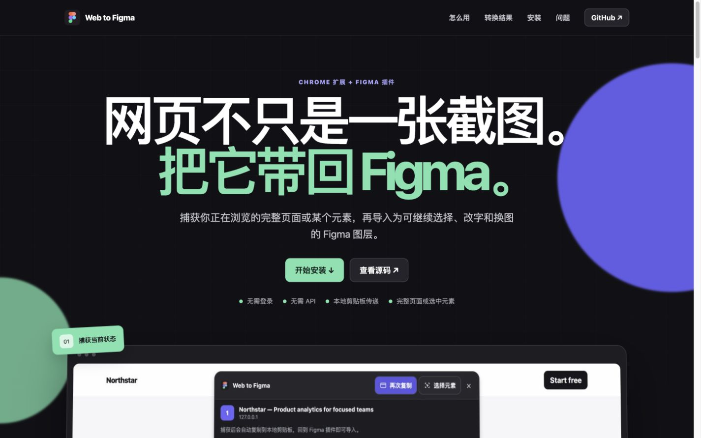
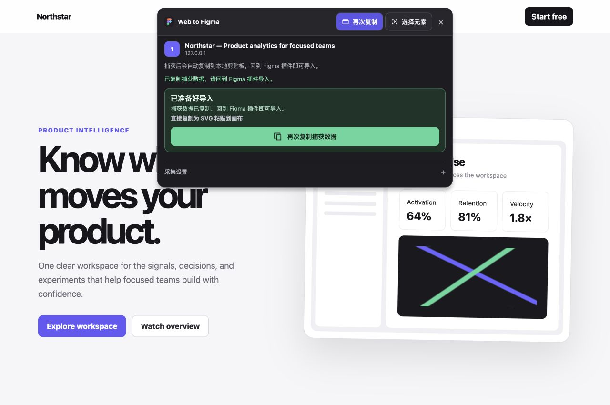
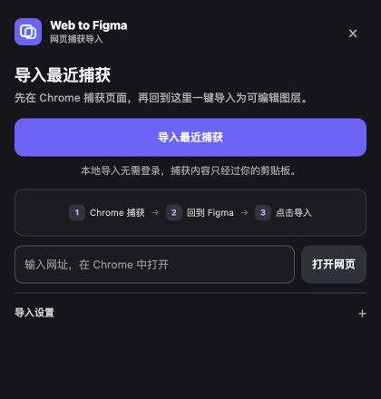

  <strong>English</strong> · <a href="./README.zh-CN.md">简体中文</a>

# Web to Figma

  
  

Capture a fully rendered page or a selected element in Chrome and import it into Figma. Standard text, containers, images, borders, and layouts are converted into editable Figma layers whenever possible.

The current version transfers capture data through the local clipboard. It does not require an account or API configuration.

  

## Features

- Capture the current full page, including content loaded while scrolling.
- Select and capture a single element or component on the page.
- Convert text, containers, borders, and images into native Figma nodes.
- Choose between visual fidelity and editable layout import modes.
- Preserve complex regions as local visual fallbacks without flattening the whole page.
- Handle long-page segments, failed import retries, and partial-layer cleanup after cancellation.

## Installation

Web to Figma is currently installed locally from GitHub.

### 1. Download the project

Select **Code → Download ZIP** on GitHub and extract the archive. You can also use Git:

    git clone https://github.com/beihaijiu-coder/web-to-figma.git
    cd web-to-figma

### 2. Install the Chrome extension

1. Open <code>chrome://extensions</code> in desktop Chrome.
2. Enable **Developer mode** in the upper-right corner.
3. Select **Load unpacked**.
4. Choose the <code>chrome-extension/</code> directory from this project.
5. Pin Web to Figma to the Chrome toolbar for easier access.

### 3. Install the Figma plugin

1. Open the Figma desktop app.
2. Go to **Plugins → Development → Import plugin from manifest**.
3. Select <code>figma-plugin/manifest.json</code>.
4. Open Web to Figma from the development plugins list when you need it.

## Usage

### Capture a full page

1. Open the page you want to import in Chrome.
2. Select the Web to Figma icon in the Chrome toolbar.
3. Select **捕获页面 (Capture page)** from the toolbar at the top of the page.
4. Wait for **已准备好导入 (Ready to import)** to appear.
5. Return to Figma and open the Web to Figma plugin.
6. Select **导入最近捕获 (Import latest capture)**.

  

### Capture one element

1. Select **选择元素 (Select element)** from the capture toolbar at the top of the page.
2. Move the pointer to preview the selection boundary, then select the target element.
3. Return to Figma and select **导入最近捕获 (Import latest capture)**.

Press <code>Esc</code> to cancel element selection. You can also use the arrow keys to adjust the selected level in a nested structure.

### Figma import panel

The plugin shows the local import flow by default. Layout mode, overflow handling, and fallback fonts are available under **导入设置 (Import settings)**. Keep the defaults if you are unsure which options to choose.

  

If Figma cannot read the clipboard directly, the plugin displays a manual paste field. Paste the capture data into that field to continue the import.

## Conversion results

| Web content | Result in Figma |
| --- | --- |
| Body text, headings, and button labels | Editable text layers |
| Containers, cards, and page regions | Frames or other selectable structures |
| Standard images and background images | Replaceable image fills |
| SVG | Vector content when the source can be parsed |
| Canvas, video, and cross-origin iframe content | Local visual fallback for the affected region |
| Unavailable web fonts | Import continues with the selected fallback font |

Each capture represents one rendered state at the current Chrome viewport. The project does not infer other responsive breakpoints from a single desktop page.

## Local data flow

The current workflow is:

    Chrome page → Local clipboard → Figma plugin

A capture is not uploaded automatically because of account information left on the computer. The <code>api/</code> directory contains earlier task-transfer experiments, but the current product interface and workflow do not enable them.

## Project structure

    chrome-extension/   Chrome page capture tools
    figma-plugin/       Figma layer importer
    marketing-site/     Project website
    docs/images/        Interface screenshots used by the README and website
    docs/demo/          Example page used for screenshots and interface checks
    tests/              Chrome, Figma, website, and end-to-end tests
    api/                Dormant task-transfer experiments

## Local development

Node.js 22 or later is required.

    npm install
    npm test

Common commands:

    npm run test:extension
    npm run test:figma
    npm run test:site
    npm run package:extension
    npm run package:figma
    npm run package:all
    npm run dev:site

<code>npm run package:extension</code> creates a Chrome directory at <code>dist/chrome-extension/</code> that can be loaded as an unpacked extension.

<code>npm run package:all</code> creates both <code>dist/chrome-extension/</code> and <code>dist/figma-plugin/</code>. GitHub CI produces the same two installable packages.

Provide an HTTPS root URL when building the production website:

    SITE_URL=https://example.com npm run build:site

## Known limitations

- Chrome internal pages, extension pages, and browser settings pages cannot be captured.
- Animation, video playback state, and interaction logic are not converted into Figma prototype behavior.
- Infinite-scroll pages may be split into separate content segments that need to be imported individually.
- Web fonts unavailable in the Figma environment are replaced with the configured fallback font.
- Some cross-origin images may require the image proxy option in capture settings.

## License

This project is available under the [MIT License](LICENSE). You may use, modify, and distribute the code while retaining the original copyright and license notice.

## Feedback

If a conversion fails or a type of web element imports incorrectly, open a [GitHub issue](https://github.com/beihaijiu-coder/web-to-figma/issues) with a public example URL, screenshots, and reproduction steps. Confirm that the example page can be shared publicly, and do not submit capture data containing private information. Project changes are listed in [CHANGELOG.md](CHANGELOG.md).
