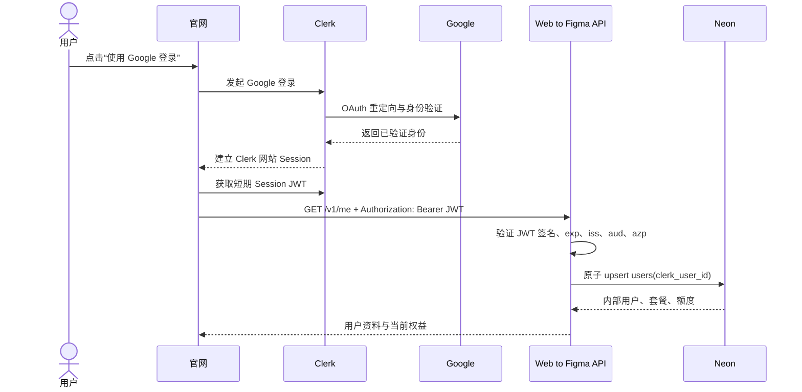
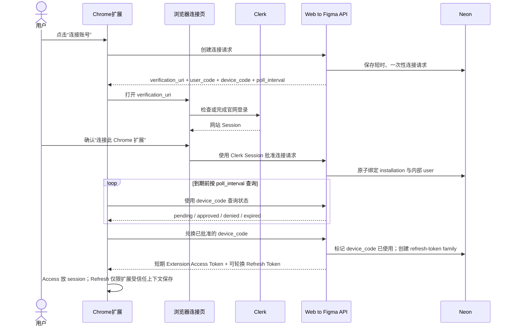
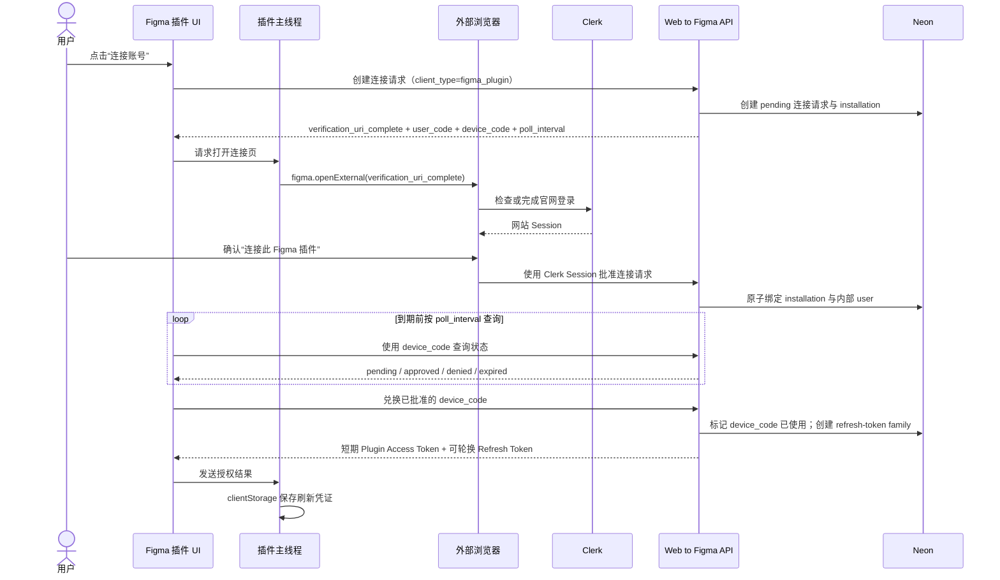
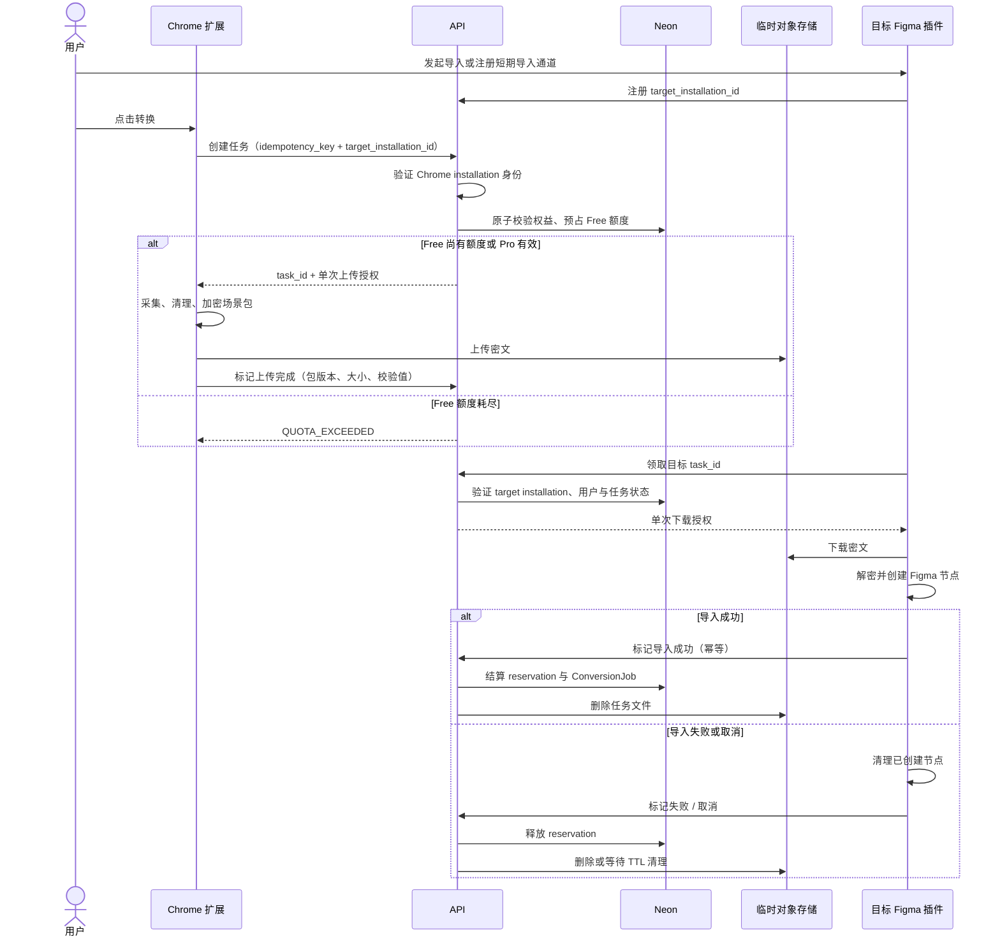

# 认证与内部用户方案（提案）

**状态：** 方案已确认；官网账号页、设备连接与加密任务中转的本地实现已完成，真实 Clerk/Neon 联调等待本地密钥填写。
**范围：** 官网登录与内部用户创建、Chrome 扩展与 Figma 插件接入，以及转换额度校验和短期任务中转。

## 目标

为 Web to Figma 提供一套可从官网延伸到 Chrome 扩展和 Figma 插件的统一身份体系，并以可审计的额度预占与结算机制，安全地中转短期转换任务。

## 职责划分

| 系统 | 职责 |
| --- | --- |
| Clerk | 用户认证、Google OAuth、会话管理、短期 Session JWT。 |
| Web to Figma API | 验证请求身份，读取并执行业务权益规则。 |
| Neon | 保存内部用户、套餐、免费周额度和后续转换任务的业务记录。 |
| Google | 仅作为外部身份提供方，不承载产品权限或额度。 |

Clerk 证明“用户是谁”；Web to Figma API 和 Neon 决定“用户可以做什么”。

## 官网登录时序



## API 身份验证

- 官网调用跨域 API 时，在 `Authorization: Bearer <session-jwt>` 中传递 Clerk Session JWT。
- API 必须验证签名、到期时间、issuer、audience 与允许来源（`azp`）；不得信任客户端自行传来的用户 ID、套餐或额度。
- 使用 Clerk 的 `authenticateRequest()` 或等效 JWT 验证。配置 JWT 公钥后可进行无网络验证；不要将“验证 Token”实现为每个请求都查询 Clerk 用户资料。
- API 的密钥和 Neon 连接串只存在服务端环境变量，绝不进入官网、扩展或 Figma 插件代码。

参考：

- [Clerk request authentication](https://clerk.com/docs/reference/backend/authenticate-request)
- [Clerk manual JWT validation](https://clerk.com/docs/backend-requests/manual-jwt)
- [Neon + Clerk guide](https://neon.com/docs/guides/auth-clerk)

## 内部用户模型

内部用户应独立于认证供应商：

```text
users
  id                 UUID，内部主键
  clerk_user_id      唯一、非空的外部身份键
  email              可选的联系信息，不作为身份主键
  created_at
  updated_at
```

- 所有业务表（套餐、免费周额度、转换任务）关联 `users.id`，而不是邮箱或 Clerk ID。
- 首次调用受保护 API 时，以 `clerk_user_id` 执行原子 upsert，避免并发登录产生重复用户。
- 不将套餐或免费周额度当作 JWT 的权威数据；这些数据由 Neon 中的业务记录决定。

## Chrome 扩展连接方案

**状态：** API、Chrome 扩展连接、目标 Figma 安装选择与加密上传已实现；真实 Clerk/Neon 联调等待本地密钥填写。
**目标：** 让桌面 Chrome 扩展取得与官网登录用户相同的 Web to Figma 身份与权益，但不在扩展中处理 Google 登录，也不向扩展发放 Clerk 会话凭证。

这是一个由 Web to Figma API 管理的“浏览器辅助设备连接”流程，设计上参考 OAuth 2.0 Device Authorization Grant 的一次性设备码与轮询模型。



### 凭证职责

| 凭证 | 使用位置 | 规则 |
| --- | --- | --- |
| Clerk Session JWT | 官网与批准连接接口 | 仅用于确认官网登录身份；不得交给 Chrome 扩展。 |
| Extension Access Token | Chrome 扩展调用 Web to Figma API | 短期有效，仅具备扩展所需的 API audience 与 scope。 |
| Extension Refresh Token | Chrome 扩展刷新自己的 Access Token | 由 Web to Figma API 签发，按 installation 轮换与撤销；不是 Clerk 或 Google Refresh Token。 |
| Google OAuth Token | Clerk 与 Google 的认证过程 | 不进入 Web to Figma 扩展、API 业务数据或 Neon。 |

### 硬约束

- `device_code` 必须高熵、一次性、短时有效；Neon 仅保存其 hash。
- 扩展按 API 返回的 `poll_interval` 查询，连接请求只能返回 `pending`、`approved`、`denied` 或 `expired`；批准前不得泄露用户资料、套餐、额度或 token。
- 连接页必须显示正在连接的产品与扩展，并允许用户明确拒绝。
- 批准连接与兑换设备码必须是原子操作，防止同一码被多次绑定或兑换。
- Refresh Token 按 installation 单独签发、轮换与撤销。用户未来可在官网查看并断开某台 Chrome 扩展。
- Access Token 优先放 `chrome.storage.session`。Refresh Token 如需跨浏览器重启保存，可放 `chrome.storage.local`，但必须限制为 `TRUSTED_CONTEXTS`；不得放入 `chrome.storage.sync`，不得传给 content script。
- API 必须区分 Clerk 网站身份和 Extension Access Token 的 audience；扩展凭证不可调用账户安全、连接批准或支付管理接口。

### 取舍

首发不使用 `chrome.identity` 取得 Chrome 账户或 Google OAuth Token。用户 Chrome 的登录账号不必等于他选择登录 Web to Figma 的账号；由官网确认身份可避免两个账号体系混淆。

参考：

- [OAuth 2.0 Device Authorization Grant (RFC 8628)](https://www.rfc-editor.org/rfc/rfc8628)
- [Chrome extension storage security](https://developer.chrome.com/docs/extensions/reference/api/storage/)

## Figma 插件连接方案

**状态：** API、Figma 插件连接、任务领取、校验、解密、导入和终态上报已实现；真实 Clerk/Neon 联调等待本地密钥填写。
**目标：** 让 Figma 插件取得与官网登录用户相同的 Web to Figma 身份与权益，同时不把 Clerk 或 Google 的凭证交给插件。

Figma 插件沿用 Chrome 扩展的“设备授权连接”协议和服务端数据模型；两者是不同的客户端安装实例，而不是两套账户体系。Figma 中应区分插件 UI iframe 与插件主线程：UI 负责 API 请求与轮询，主线程负责 `figma.openExternal()`、`figma.clientStorage` 和 Figma 文档操作。



### 与 Chrome 扩展共用的服务端模型

- 使用同一套 `connection_requests`、`installations` 与 `refresh_token_families`；通过 `client_type = chrome_extension | figma_plugin` 区分安装来源。
- `connection_requests` 至少记录连接状态、`device_code` 的 hash、`user_code`、轮询间隔、过期时间、批准时间与消费时间。状态仅为 `pending`、`approved`、`denied` 或 `expired`。
- 批准连接、首次兑换设备码、Refresh Token 轮换和撤销都必须是原子操作；一个设备码只能绑定、兑换一次。
- 用户将来可在官网按 installation 查看并断开某个 Chrome 扩展或 Figma 插件，而不影响其他客户端。

### 凭证与本地存储

| 凭证 | 使用位置 | 规则 |
| --- | --- | --- |
| Clerk Session JWT | 官网与浏览器批准连接接口 | 仅用于确认官网登录身份；绝不进入 Figma 插件。 |
| Plugin Access Token | Figma 插件调用 Web to Figma API | 短期有效，仅具备 Figma 插件所需的 audience 与 scope；优先只留在运行内存。 |
| Plugin Refresh Token | Figma 插件恢复登录态并刷新 Access Token | API 自行签发的、不透明且可轮换的 installation 凭证；不是 Clerk 或 Google Refresh Token。 |
| Google OAuth Token | Clerk 与 Google 的认证过程 | 不进入插件、API 业务数据或 Neon。 |

- `device_code` 仅由插件持有并用于轮询，不能放入外部浏览器 URL。浏览器使用 `verification_uri_complete` 或仅含 `user_code` 的确认页。
- `figma.clientStorage` 可保存 API 自行签发的刷新凭证，但不得被当作安全保险箱：用户有能力提取其内容，清缓存会清除数据，且更换 Figma 插件 ID 后无法读取旧数据。服务端必须按该风险设计：短空闲期和绝对有效期、每次刷新即轮换、复用检测、按 installation 立即撤销。
- 登录态失效、清缓存、换设备或插件 ID 变化后，要求用户重新连接是正常且可预期的行为。
- 不保存 Clerk Session、Google Token、用户密码或付款信息；刷新凭证只允许调用 Figma 插件所需的 API audience，不得调用账户安全、连接批准或支付管理接口。

### Figma 特有约束

- `figma.openExternal()` 由插件主线程调用；插件 UI 通过消息要求主线程打开确认页，UI 再负责轮询并把结果传回主线程存储。
- `figma.openExternal()` 只负责打开浏览器标签页，不提供回调；设备码轮询正是用于关闭浏览器与插件之间的回传缺口。
- 域名确定后，在 Figma manifest 的 `networkAccess.allowedDomains` 中只加入官网与 API 的明确 HTTPS 域名；开发环境单独列入 `devAllowedDomains`，不使用宽泛通配符。
- Figma 插件身份不等同于 Figma 账户身份；不以 Figma 的当前用户资料替代 Clerk 登录或 Web to Figma 的内部用户。

参考：

- [Figma 插件运行模型](https://developers.figma.com/docs/plugins/how-plugins-run/)
- [figma.openExternal](https://developers.figma.com/docs/plugins/api/properties/figma-openexternal/)
- [Figma clientStorage](https://developers.figma.com/docs/plugins/api/figma-clientStorage/)
- [Figma manifest 的网络访问配置](https://developers.figma.com/docs/plugins/manifest/)

## 转换任务、额度与短期中转

**状态：** 本地端到端实现已完成，包括额度预占、AES-GCM 密文上传、指定安装领取、成功结算、失败/取消释放与过期回收。
**目标：** 将当前 Chrome 扩展采集的场景包短期、加密地交给指定的 Figma 插件导入；Free 用户仅在一次完整导入成功后消耗周额度，Pro 用户不消耗周额度但仍受技术上限约束。

本服务是短期加密任务中转，不承担网页转换的主要计算，也不作为长期网页内容仓库。Chrome 扩展负责采集与上传，Figma 插件负责下载与创建节点，API 只负责身份、权益、状态机、授权和清理编排。

### 核心原则

- 一个任务必须指定一个 `target_installation_id`（目标 Figma 插件安装实例）。不能以“同一用户的任意 Figma 插件都可查询待导入任务”的方式分发，否则多设备会串单，也无法为更强的端到端加密预留边界。
- Figma 插件先注册一个短期导入通道，Chrome 扩展创建任务时带上该目标 installation。API 同时验证 Chrome installation、目标 Figma installation 与内部用户之间的归属关系。
- Free 的额度在建任务时预占，在完整导入成功时结算；预占不等于已消耗。取消、采集失败、上传过期、无人领取或导入失败必须原子释放预占。
- Pro 不按任务扣除周额度，但仍须执行并发任务数、场景包体积、任务时长和防滥用等技术上限。
- 同一任务只允许一个 Figma installation 成功领取和导入；所有创建、领取、完成、失败和取消请求都必须具备幂等处理。

### 时序



### 任务状态机

```text
created
→ quota_reserved
→ upload_issued
→ uploaded
→ claimed
→ importing
→ imported        （Free reservation 结算为一次完成转换）

任意未完成状态可进入：
cancelled / capture_failed / upload_expired / import_failed / expired
→ 释放未结算 reservation，并安排删除临时文件
```

- 只有 `imported` 是一次 Free 完整转换的结算条件。局部内容可视降级并不影响结算；整次导入失败则不结算。
- Figma 插件在报告 `import_failed` 或 `cancelled` 前，必须先删除已创建的半成品节点；这与产品的“取消清理”承诺一致。
- `imported`、`import_failed` 与 `cancelled` 都应携带操作幂等键；重复上报只返回既有的最终状态，不能重复扣减、释放或创建 Usage 记录。

### 服务端记录与原子性

建议以独立的账务预占记录表达 Free 额度，而不是直接递增或递减计数：

```text
conversion_jobs
  id
  user_id
  source_installation_id
  target_installation_id
  status
  idempotency_key
  object_key
  scene_package_version
  expires_at
  claimed_at
  completed_at

quota_reservations
  id
  user_id
  conversion_job_id（唯一）
  product_week
  status: reserved | settled | released
  reserved_at
  settled_at
  released_at

usage_events
  id
  user_id
  conversion_job_id（唯一）
  kind: completed_conversion
  occurred_at
```

- 创建任务时，在一个数据库事务内验证套餐状态、计算该产品周已结算和已预占的 Free 额度，并写入 `quota_reservations(status=reserved)`；同一 `user_id + idempotency_key` 重试返回原任务。
- 完成导入时，在一个事务内锁定任务和 reservation，将任务设为 `imported`、reservation 设为 `settled`，并创建唯一的 `usage_events` 记录。
- 失败、取消或过期时，在一个事务内将仍为 `reserved` 的 reservation 设为 `released`。终态重复请求不得改变结果。
- 需要为用户设定有限的未完成任务上限，避免 Free 用户通过大量 pending 任务长期占住额度；过期任务由后台作业回收。

### 临时对象存储与加密

- 当前本地实现由 API 代理到开发用 package store，便于先完成端到端闭环；生产实现应改为 API 只发放绑定到单一 `task_id`、单一对象键、短时有效的上传/下载授权，由 Chrome 与 Figma 直接同对象存储传输，API 不代理场景包字节。
- 场景包应具有明确的 `scene_package_version`、最大体积、内容长度与 SHA-256 校验值。加密封装应使用具备完整性校验的 AEAD 格式，导入端解密失败或校验不符即视为任务失败。
- 首发可采用“客户端加密场景包 + 服务端编排密钥访问”的模型，确保对象存储中的内容不可直接读取。若产品承诺 API 也不能读取场景内容，则必须另行设计 Chrome 与目标 Figma installation 的公钥/信封密钥交换；不可仅以“上传了密文”宣称端到端加密。
- 成功导入后立即请求删除对象；任务失败、取消或过期时也请求删除，并以对象存储生命周期 TTL 作为最终兜底。删除重试不应阻塞任务的终态结算。
- 不把 Cookie、密码、浏览器会话内容或无关网页敏感参数放入场景包或任务元数据。任务元数据仅保留导入与审计所必需的信息，并遵循短期保留原则。

## 隐私与权限

- Google OAuth 只请求登录所需的 OpenID Connect 基础资料；不请求 Gmail、Drive 或其他无关权限。
- 不采集、不上传用户 Cookie、密码、浏览器会话内容或网页敏感参数。
- 认证服务与产品业务数据分工明确：Clerk 保存身份和会话；网页采集数据不应作为长期认证资料保存。

## 分阶段落地

1. 官网 Google 登录、Session JWT、`GET /v1/me` 与内部用户 upsert。**官网 `/account/` 与 API 已接入，真实 Clerk 联调待密钥填写。**
2. Neon 中的套餐与免费周额度数据模型、服务端权益检查。**迁移与本地测试已实现。**
3. Chrome 扩展与 Figma 插件接入统一身份。**设备连接、批准、轮询、安装绑定、Access/Refresh Token 轮换已在 API 层实现；Chrome 扩展 popup、Figma 插件 UI 与官网 `/connect/device/` 开发连接入口已接入。**
4. 转换任务与短期中转。**Chrome 加密上传、指定 Figma 安装领取解密、导入终态结算、取消清理和过期回收已形成本地端到端实现。**
5. Clerk webhook：处理用户删除及必要的身份同步。
6. 支付与 Pro 权益 webhook。

## 尚待讨论

- 是否第一版同时提供邮箱验证码登录，作为不使用 Google 的替代方式。
- API 的部署平台、域名与 CORS / Clerk `authorizedParties` 配置。
- 用户删除、数据导出与隐私政策的具体流程。
